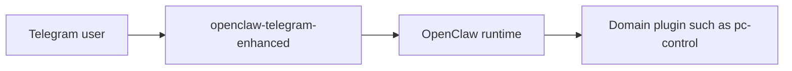

# openclaw-telegram-enhanced

`openclaw-telegram-enhanced` is a bundled Telegram channel replacement for OpenClaw.

It exists because some Telegram behavior belongs at the channel layer, not in OpenClaw core and not in domain plugins like `pc-control`.

## What This Repository Is For

This repository is for Telegram-specific behavior such as:

- delivery shaping
- button-based approval UX
- local/staged media delivery
- deterministic Telegram-side routing helpers
- integration hooks for domain plugins

It is not for:

- host-control policy
- Windows bridge enforcement
- generic OpenClaw runtime orchestration

## Architecture Role

This plugin owns Telegram-specific transport and UX behavior. Domain plugins own domain logic.

## Why It Exists Separately From `pc-control`

`pc-control` is only one integration.

This repository exists so Telegram-specific improvements stay reusable even when the domain behavior changes. For example:

- `pc-control` can use it for screenshots and file delivery
- another plugin could later use the same button and media behavior

## Deployment Model

This plugin replaces the bundled OpenClaw `telegram` channel through the bundled-plugin seam.

Important distinction:

- repository/project name: `openclaw-telegram-enhanced`
- runtime plugin id: `telegram`

That is intentional. The runtime must still see it as the `telegram` channel plugin.

## Main Capabilities

- bundled Telegram channel replacement
- document-style delivery for staged local media
- button-driven approval flows
- deterministic routing hooks for selected Telegram actions
- integration support for `pc-control`

## Start Here

Read in this order:

1. [docs/architecture.md](/home/mfshaf7/projects/openclaw-telegram-enhanced/docs/architecture.md)
2. [docs/install.md](/home/mfshaf7/projects/openclaw-telegram-enhanced/docs/install.md)
3. [docs/configuration.md](/home/mfshaf7/projects/openclaw-telegram-enhanced/docs/configuration.md)

## Relationship To Other Repositories

- `pc-control-bridge` owns host enforcement
- `pc-control-openclaw-plugin` exposes host operations as tools
- `openclaw-telegram-enhanced` owns Telegram-specific delivery and UX behavior
