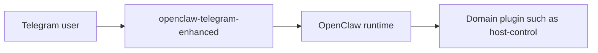

# openclaw-telegram-enhanced

`openclaw-telegram-enhanced` is the canonical Telegram channel plugin source
for this workspace.

It exists because some behavior belongs at the channel layer, not in OpenClaw
core and not in domain plugins such as `host-control`.

## What This Repository Owns

This repository owns Telegram-specific behavior such as:

- delivery shaping
- button-driven approval UX
- staged and local media delivery behavior
- deterministic Telegram-side routing helpers
- Telegram integration hooks for domain plugins

It does not own:

- host policy or allowed-root enforcement
- Windows or WSL bridge behavior
- environment promotion or deployment approval

## Architecture Role

```mermaid
flowchart LR
    User[Telegram user]
    Plugin[openclaw-telegram-enhanced]
    Gateway[OpenClaw runtime]
    Domain[Domain plugin such as host-control]

    User --> Plugin --> Gateway --> Domain
```

This repository owns the Telegram transport and UX layer. Domain plugins own
domain logic. The host bridge owns host enforcement.

## Current Workflow Role

1. Telegram behavior changes land here first.
2. The active runtime composition path stages this repo through
   `openclaw-runtime-distribution`.
3. `platform-engineering` pins the resulting source SHA and digest for the
   governed environment.
4. Stage verifies real Telegram behavior before anything is promoted to prod.

## Audit And Visibility

Telegram behavior is mostly evidenced through packaging, logs, and real runtime
checks rather than a dedicated metrics surface.

- package and repo validation:
  - `npm run test:standalone`
  - `npm run test:bundle`
  - `npm pack` when packaging metadata matters
- runtime evidence:
  - gateway logs
  - real Telegram reply and delivery behavior
  - staged media send behavior
  - approval and callback handling

If Telegram delivery or approval behavior changes, docs and stage verification
steps should change with it.

## Relationship To The Build Path

This repository is the canonical source.

The current governed stage/prod image path stages it through
`openclaw-runtime-distribution`. It should not be treated as a copied source
tree inside other repos.

Operational rule:

- if the bundled Telegram runtime is patched directly in a live container, the
  same change must be backported here and then carried through the governed
  build path before the deployment is considered reproducible

## Start Here

Read in this order:

1. [docs/architecture.md](docs/architecture.md)
2. [docs/install.md](docs/install.md)
3. [docs/configuration.md](docs/configuration.md)

## Relationship To Other Repositories

- `openclaw-host-bridge`
  - host enforcement and audit
- `host-control-openclaw-plugin`
  - typed host-control tools and plugin contract
- `openclaw-runtime-distribution`
  - active gateway composition path
- `platform-engineering`
  - environment approval and promotion
