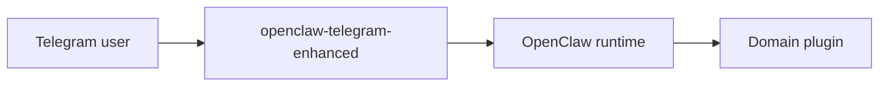

# Architecture

## Purpose

This document explains where `openclaw-telegram-enhanced` sits in the overall OpenClaw system.

## System Position

## What This Plugin Owns

- Telegram delivery behavior
- Telegram approval UX
- Telegram-specific shortcut routing
- Telegram handling for local/staged media

## What This Plugin Does Not Own

- host-control policy
- bridge security rules
- Windows-specific execution
- generic OpenClaw core behavior

## Integration Model

The intended pattern is:

- `openclaw-telegram-enhanced` handles Telegram-specific transport and UX
- domain plugins provide the actual domain logic

Example:

- `host-control` provides typed host operations
- this plugin provides the Telegram-side confirmation, screenshot, and file-delivery behavior

## Why This Is Better Than Patching Core

- smaller change surface
- clearer repo boundary
- cleaner upgrades against upstream OpenClaw
- Telegram behavior stays versioned as a channel replacement instead of leaking into core
